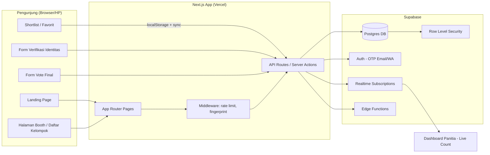
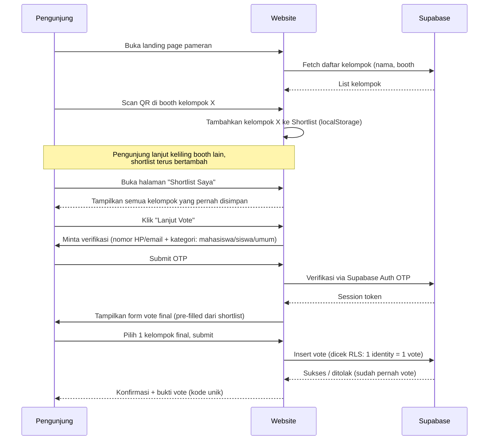
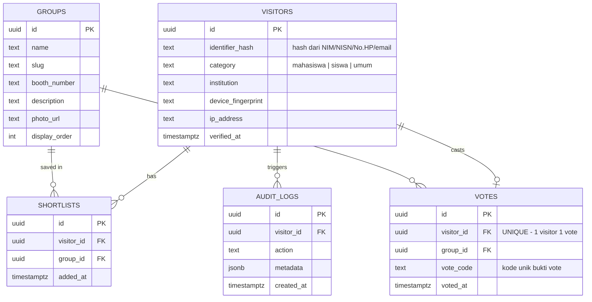

# Architecture Document — Sistem Voting Pameran Capstone

**Tema Visual:** Tech Jungle
**Tech Stack:** TypeScript · Next.js (App Router) · Supabase (Postgres, Auth, RLS, Realtime)
**Target Pengguna:** Mahasiswa, siswa, dan pengunjung umum

---

## 1. Ringkasan & Tujuan

Sistem ini memungkinkan pengunjung pameran capstone untuk melakukan voting terhadap kelompok/tim proyek melalui website custom. Tiga prinsip utama desain sistem:

1. **Adil** — satu pengunjung = satu suara, tidak peduli kategorinya (mahasiswa/siswa/umum), kecuali panitia memutuskan bobot berbeda per kategori (opsional, lihat §7.4).
2. **Anti-kecurangan** — kombinasi verifikasi identitas, pembatasan device/IP, dan audit trail membuat vote ganda/manipulasi sangat sulit dan mudah terdeteksi.
3. **Mudah diingat** — pengunjung bisa "menyimpan" kelompok favorit saat berkeliling booth, sehingga saat mengisi form vote akhir mereka tidak lupa kelompok mana yang ingin dipilih.

---

## 2. High-Level Architecture



**Alasan pilihan stack:**
- **Next.js App Router**: server actions memudahkan validasi vote di server (bukan client) — penting untuk anti-fraud.
- **Supabase Auth (OTP)**: verifikasi email/nomor tanpa perlu bangun sistem auth sendiri, gratis untuk skala event kampus.
- **Supabase RLS**: aturan "1 user hanya boleh insert 1 row vote" ditegakkan di level database, bukan cuma di frontend — jadi tidak bisa dilewati lewat DevTools/API call langsung.
- **Realtime**: dashboard panitia bisa pantau live tanpa polling manual.

---

## 3. Alur Pengguna (User Flow)

### 3.1 Flow Utama: Jelajah → Simpan Favorit → Vote



### 3.2 Fitur "Ingat Kelompok" (Shortlist / Favorit)

Ini menjawab masalah: pameran biasanya punya belasan-puluhan booth, pengunjung gampang lupa nama/nomor kelompok yang mereka suka setelah keliling.

- Setiap booth punya **QR code unik** (link ke `/kelompok/[slug]?add=favorit`).
- Saat discan, kelompok otomatis masuk ke **Shortlist** yang disimpan di:
  - `localStorage` (agar tetap ada walau belum login/verifikasi), lalu
  - disinkronkan ke tabel `shortlists` di Supabase begitu user terverifikasi (supaya tidak hilang kalau ganti device/browser closed).
- Ada tombol manual "❤️ Simpan ke Favorit" di setiap kartu kelompok (untuk yang tidak scan QR).
- Halaman **"Shortlist Saya"** menampilkan semua kelompok tersimpan dengan foto+nama+booth, memudahkan user membandingkan sebelum vote final.
- Saat submit vote, sistem menampilkan ulang shortlist sebagai pilihan cepat (radio button), bukan user harus cari nama dari nol.

---

## 4. Data Model (ERD)



**Catatan penting:**
- `identifier_hash` disimpan sebagai **hash** (bukan plaintext NIM/email) untuk privasi, tapi tetap unik agar bisa dicek duplikasi.
- Kolom `visitor_id` di tabel `VOTES` diberi **UNIQUE constraint** → level database menolak vote kedua dari orang yang sama.
- `vote_code` diberikan ke user sebagai bukti (mirip struk), berguna kalau ada sengketa/audit.

---

## 5. Mekanisme Anti-Kecurangan (Berlapis)

| Lapisan | Mekanisme | Mencegah |
|---|---|---|
| 1. Identitas | Verifikasi OTP via email/WhatsApp + input NIM/NISN/No. Identitas | Bot/asal isi form |
| 2. Database | `UNIQUE(visitor_id)` di tabel votes + RLS policy `insert` hanya jika belum ada row | Vote ganda walau lewat API langsung |
| 3. Device | Fingerprint browser (canvas/user-agent hash) disimpan saat verifikasi | Ganti akun tapi device sama → flag di dashboard |
| 4. Jaringan | Rate limiting per IP di middleware Next.js (mis. maks 3 percobaan verifikasi/menit) | Spam OTP request |
| 5. Waktu | Vote hanya dibuka dalam window waktu event (`vote_open_at` – `vote_close_at`), dicek di server | Vote di luar jam pameran |
| 6. Audit | Semua aksi (request OTP, submit vote, gagal vote) dicatat di `audit_logs` | Deteksi pola anomali pasca-event |
| 7. Transparansi | Hasil akhir tidak ditampilkan real-time ke publik (hanya panitia), untuk hindari efek bandwagon/manipulasi sosial | Vote ikut-ikutan tren |

**Catatan realistis:** tidak ada sistem online yang 100% anti-fraud tanpa KTP fisik/e-KYC. Kombinasi di atas menaikkan biaya kecurangan secara signifikan dan cukup untuk skala event kampus. Kalau butuh lebih ketat, tambahkan **verifikasi tiket masuk fisik** (QR tiket dari panitia saat check-in) sebagai syarat sebelum bisa vote — ini opsi paling kuat karena mengikat 1 tiket fisik = 1 hak vote.

---

## 6. Struktur Folder (Next.js App Router)

```
tech-jungle-vote/
├─ app/
│  ├─ (public)/
│  │  ├─ page.tsx                  # Landing
│  │  ├─ kelompok/
│  │  │  ├─ page.tsx                # Daftar semua kelompok
│  │  │  └─ [slug]/page.tsx         # Detail kelompok + tombol favorit
│  │  ├─ shortlist/page.tsx         # Shortlist saya
│  │  ├─ verifikasi/page.tsx        # Form OTP
│  │  └─ vote/page.tsx              # Form vote final
│  ├─ (admin)/
│  │  └─ dashboard/page.tsx         # Live count, audit log, export
│  ├─ api/
│  │  ├─ auth/otp/route.ts
│  │  ├─ vote/route.ts
│  │  ├─ shortlist/route.ts
│  │  └─ webhook/route.ts
│  ├─ layout.tsx
│  └─ middleware.ts                 # rate limit + fingerprint check
├─ components/
│  ├─ ui/                           # design system components
│  ├─ GroupCard.tsx
│  ├─ ShortlistDrawer.tsx
│  └─ VoteConfirmation.tsx
├─ lib/
│  ├─ supabase/client.ts
│  ├─ supabase/server.ts
│  ├─ fingerprint.ts
│  └─ rateLimiter.ts
├─ styles/
│  └─ theme.css                     # tech jungle design tokens
└─ supabase/
   ├─ migrations/
   └─ policies.sql                  # RLS rules
```

---

## 7. Desain Visual — Tema "Tech Jungle"

### 7.1 Palet Warna

| Nama | Hex | Peran |
|---|---|---|
| Fern Green | `#437118` | Warna primer — aksen tombol utama, ikon "daun/tech" |
| Pistachio | `#AFD06E` | Sekunder — hover state, highlight kartu |
| Beige | `#F5F3D8` | Background utama (terang, seperti kabut hutan) |
| Carolina Blue | `#87AECE` | Aksen "teknologi" — link, badge, grafik |
| Delft Blue | `#1D2A62` | Warna teks gelap / footer / dark section |

**Kombinasi disarankan:**
- Background: `#F5F3D8` (Beige)
- Teks utama: `#1D2A62` (Delft Blue)
- Tombol CTA (Vote/Simpan Favorit): `#437118` (Fern Green) dengan hover `#AFD06E` (Pistachio)
- Badge/status "Terverifikasi", chart bar: `#87AECE` (Carolina Blue)

### 7.2 Mood & Elemen Visual
- Kombinasi **organik (dedaunan, garis lengkung, tekstur daun low-poly)** dengan elemen **digital (grid, garis sirkuit, glow tipis)** — merepresentasikan "jungle" (alam) bertemu "tech".
- Ikon booth kelompok bisa pakai bentuk daun sebagai pin lokasi.
- Font disarankan: heading dengan font geometris/tebal (kesan "tech"), body dengan font humanis agar tetap nyaman dibaca (kesan "jungle"/organik).

### 7.3 Komponen Kunci
- `GroupCard`: foto kelompok, badge nomor booth, tombol hati (favorit).
- `ShortlistDrawer`: panel slide-in menampilkan semua favorit, badge counter.
- `VoteConfirmation`: layar sukses dengan kode vote + animasi daun/partikel ringan.

### 7.4 Opsional: Bobot Suara per Kategori
Jika panitia ingin suara mahasiswa/siswa/umum tidak disamakan bobotnya (mis. penilaian juri vs pengunjung), tambahkan kolom `weight` di tabel `VOTES` yang diisi otomatis berdasarkan `category` visitor, lalu hitung skor akhir = `SUM(weight)` bukan `COUNT(votes)`. Default rekomendasi: **semua kategori bobot sama (1 orang 1 suara)** agar sistem tetap sederhana dan mudah dipercaya adil.

---

## 8. Keamanan & Privasi Tambahan

- **Enkripsi in-transit**: HTTPS via Vercel (default).
- **RLS Policies** (contoh inti di `policies.sql`):
  - `visitors`: user hanya bisa `select`/`update` row miliknya sendiri (`auth.uid() = id`).
  - `votes`: `insert` diizinkan hanya jika `NOT EXISTS (SELECT 1 FROM votes WHERE visitor_id = auth.uid())`.
  - `groups`: read-only untuk publik, write hanya untuk role `admin`.
- **Data minimal**: simpan hash identitas, bukan data mentah (NIM/no HP asli) di tabel yang bisa diakses luas.
- **Retention**: data pengunjung bisa dijadwalkan terhapus otomatis (cron/Edge Function) beberapa minggu setelah event selesai, sesuai kebutuhan privasi.

---

## 9. Deployment (Low-Cost / Free Tier)

| Layer | Layanan | Catatan |
|---|---|---|
| Hosting frontend & API | Vercel (Hobby) | Cukup untuk trafik event kampus |
| Database & Auth | Supabase (Free tier) | 500MB DB, cukup untuk ribuan vote |
| Domain | Subdomain gratis Vercel atau domain kampus | Opsional custom domain |
| Monitoring | Supabase Dashboard + Vercel Analytics | Gratis, cukup untuk live monitoring |

---

## 10. Roadmap Implementasi Singkat

1. Setup Supabase project + schema (`groups`, `visitors`, `votes`, `shortlists`, `audit_logs`) + RLS policies.
2. Bangun halaman publik: landing, daftar kelompok, detail kelompok + tombol favorit.
3. Implementasi shortlist (localStorage → sync ke DB saat verifikasi).
4. Implementasi verifikasi OTP (Supabase Auth) + rate limiting middleware.
5. Implementasi form vote final + validasi server-side (server actions).
6. Bangun dashboard admin (live count via Supabase Realtime, export CSV, audit log viewer).
7. Styling sesuai design system Tech Jungle.
8. QA: uji coba skenario curang (vote ganda, device sama, luar jam) sebelum hari-H.
